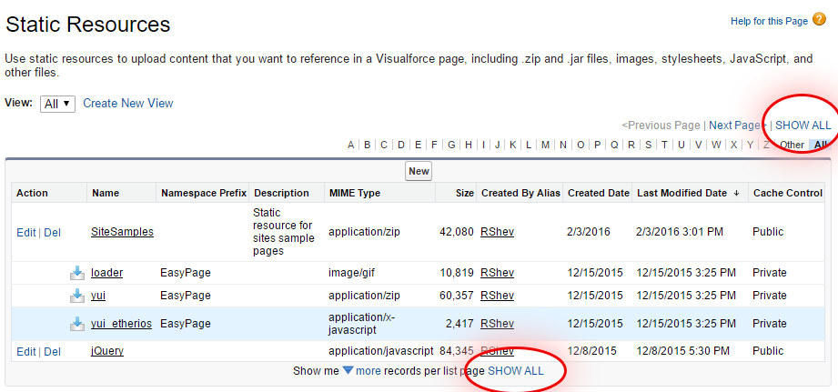

### "Show All" button for SalesForce Classic

Please, see new better script [Show1000RecordsPerPage](https://github.com/Romms/Salesforce-Trics/tree/master/ClassicUI/Show1000RecordsPerPage)

This script adds "SHOW ALL" buttons for SalesForce Classic pages where are long lists with "show more" or "&lt;Previous Page | Next Page&gt;" links.

You should add this JS to site as custom code.

You can do it with this Chrome plugin:

* Custom JS: https://chrome.google.com/webstore/detail/custom-javascript-for-web/poakhlngfciodnhlhhgnaaelnpjljija

Example:

